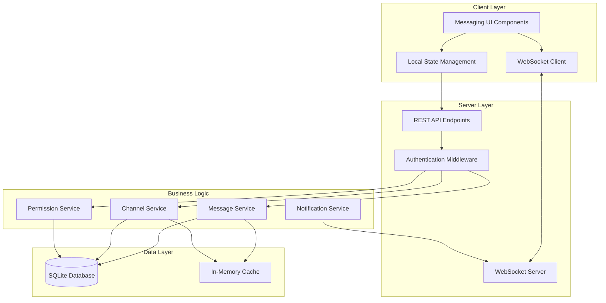

# Design Document: Internal Messaging System

## Overview

The Internal Messaging System is a Discord-like communication module that provides real-time messaging capabilities within the application. The system supports both direct messages (DMs) and organized channels with a comprehensive role-based permission system.

### Key Features

- Real-time bidirectional communication using WebSockets
- Direct messaging between users
- Topic-based channels for group discussions
- Three-tier role system (Admin, Moderator, Member)
- Granular permission management
- Message search and history
- Notification system with customizable preferences
- Markdown formatting support
- Complete module isolation from existing codebase

### Design Goals

1. **Modularity**: Implement as a standalone module with minimal dependencies on existing code
2. **Real-time Performance**: Deliver messages within 2 seconds using WebSocket connections
3. **Scalability**: Support multiple concurrent users and channels efficiently
4. **Security**: Enforce role-based access control and prevent common vulnerabilities
5. **User Experience**: Provide an intuitive Discord-like interface with instant feedback

## Architecture

### System Architecture

The messaging system follows a client-server architecture with real-time communication:



### Module Structure

The messaging system is organized into isolated modules:

- **messaging-core/**: Core messaging logic and services
- **messaging-ui/**: React components for the messaging interface
- **messaging-api/**: REST API endpoints and WebSocket handlers
- **messaging-db/**: Database schema and data access layer
- **messaging-types/**: TypeScript type definitions

### Technology Stack

- **Frontend**: React with TypeScript, WebSocket client
- **Backend**: Node.js with WebSocket server (ws library)
- **Database**: SQLite with better-sqlite3
- **Real-time**: WebSocket protocol for bidirectional communication
- **State Management**: React Context API for local state
- **Styling**: CSS modules matching existing application theme

## Components and Interfaces

### Core Components

#### 1. WebSocket Manager

Manages WebSocket connections and real-time message delivery.

```typescript
interface WebSocketManager {
  connect(userId: string, token: string): Promise<WebSocket>;
  disconnect(userId: string): void;
  send(userId: string, message: WebSocketMessage): void;
  broadcast(channelId: string, message: WebSocketMessage): void;
  getOnlineUsers(): string[];
}
```

#### 2. Message Service

Handles message creation, retrieval, and management.

```typescript
interface MessageService {
  sendDirectMessage(senderId: string, recipientId: string, content: string): Promise<Message>;
  sendChannelMessage(senderId: string, channelId: string, content: string): Promise<Message>;
  getDirectMessages(userId1: string, userId2: string, limit: number, offset: number): Promise<Message[]>;
  getChannelMessages(channelId: string, limit: number, offset: number): Promise<Message[]>;
  deleteMessage(messageId: string, userId: string): Promise<void>;
  searchMessages(userId: string, query: string, filters: SearchFilters): Promise<Message[]>;
}
```

#### 3. Channel Service

Manages channel creation, configuration, and membership.

```typescript
interface ChannelService {
  createChannel(creatorId: string, name: string, description?: string, isPrivate?: boolean): Promise<Channel>;
  updateChannel(channelId: string, updates: Partial<Channel>): Promise<Channel>;
  deleteChannel(channelId: string): Promise<void>;
  getChannels(userId: string): Promise<Channel[]>;
  addMember(channelId: string, userId: string): Promise<void>;
  removeMember(channelId: string, userId: string): Promise<void>;
  getMembers(channelId: string): Promise<User[]>;
}
```

#### 4. Permission Service

Enforces role-based access control.

```typescript
interface PermissionService {
  checkPermission(userId: string, permission: Permission): boolean;
  assignRole(userId: string, role: Role): Promise<void>;
  getUserRole(userId: string): Promise<Role>;
  canAccessChannel(userId: string, channelId: string): Promise<boolean>;
  canDeleteMessage(userId: string, messageId: string): Promise<boolean>;
}
```

#### 5. Notification Service

Manages user notifications and unread counts.

```typescript
interface NotificationService {
  notifyDirectMessage(recipientId: string, message: Message): void;
  notifyMention(userId: string, message: Message): void;
  getUnreadCount(userId: string, conversationId: string): Promise<number>;
  markAsRead(userId: string, conversationId: string): Promise<void>;
  updatePreferences(userId: string, channelId: string, preference: NotificationPreference): Promise<void>;
}
```

### UI Components

#### 1. MessagingContainer

Root component that orchestrates the messaging interface.

```typescript
interface MessagingContainerProps {
  currentUserId: string;
  authToken: string;
}
```

#### 2. ChannelList

Displays available channels and direct messages in the left sidebar.

```typescript
interface ChannelListProps {
  channels: Channel[];
  directMessages: DirectMessageConversation[];
  activeConversationId: string;
  onSelectConversation: (id: string, type: 'channel' | 'dm') => void;
  unreadCounts: Map<string, number>;
}
```

#### 3. MessageView

Displays messages for the active conversation.

```typescript
interface MessageViewProps {
  messages: Message[];
  conversationType: 'channel' | 'dm';
  onLoadMore: () => void;
  onDeleteMessage: (messageId: string) => void;
}
```

#### 4. MessageInput

Input field for composing and sending messages.

```typescript
interface MessageInputProps {
  onSend: (content: string) => void;
  onTyping: () => void;
  maxLength: number;
}
```

#### 5. UserList

Displays channel members with online status in the right sidebar.

```typescript
interface UserListProps {
  users: User[];
  onlineUsers: Set<string>;
  currentUserId: string;
  onUserClick: (userId: string) => void;
}
```

### API Endpoints

#### REST API

```
POST   /api/messaging/channels              - Create channel
GET    /api/messaging/channels              - Get user's channels
PUT    /api/messaging/channels/:id          - Update channel
DELETE /api/messaging/channels/:id          - Delete channel
POST   /api/messaging/channels/:id/members  - Add member
DELETE /api/messaging/channels/:id/members/:userId - Remove member

GET    /api/messaging/messages/channel/:id  - Get channel messages
GET    /api/messaging/messages/dm/:userId   - Get DM messages
POST   /api/messaging/messages              - Send message (fallback)
DELETE /api/messaging/messages/:id          - Delete message

GET    /api/messaging/search                - Search messages
GET    /api/messaging/notifications         - Get unread counts
PUT    /api/messaging/notifications/:id     - Update notification preferences

POST   /api/messaging/roles                 - Assign role
GET    /api/messaging/roles/:userId         - Get user role
```

#### WebSocket Events

```typescript
// Client -> Server
type ClientEvents = {
  'message:send': { channelId?: string; recipientId?: string; content: string };
  'typing:start': { conversationId: string };
  'typing:stop': { conversationId: string };
  'presence:update': { status: 'online' | 'away' | 'offline' };
};

// Server -> Client
type ServerEvents = {
  'message:new': { message: Message };
  'message:deleted': { messageId: string };
  'typing:indicator': { userId: string; conversationId: string };
  'presence:changed': { userId: string; status: string };
  'notification:new': { type: string; data: any };
};
```

## Data Models

### Database Schema

#### Users Table
```sql
CREATE TABLE messaging_users (
  id TEXT PRIMARY KEY,
  username TEXT NOT NULL UNIQUE,
  display_name TEXT NOT NULL,
  role TEXT NOT NULL DEFAULT 'member' CHECK(role IN ('admin', 'moderator', 'member')),
  status TEXT NOT NULL DEFAULT 'offline' CHECK(status IN ('online', 'away', 'offline')),
  created_at INTEGER NOT NULL,
  last_seen INTEGER NOT NULL
);
```

#### Channels Table
```sql
CREATE TABLE messaging_channels (
  id TEXT PRIMARY KEY,
  name TEXT NOT NULL UNIQUE,
  description TEXT,
  is_private INTEGER NOT NULL DEFAULT 0,
  created_by TEXT NOT NULL,
  created_at INTEGER NOT NULL,
  FOREIGN KEY (created_by) REFERENCES messaging_users(id)
);

CREATE INDEX idx_channels_name ON messaging_channels(name);
```

#### Channel Members Table
```sql
CREATE TABLE messaging_channel_members (
  channel_id TEXT NOT NULL,
  user_id TEXT NOT NULL,
  joined_at INTEGER NOT NULL,
  notification_preference TEXT NOT NULL DEFAULT 'all' CHECK(notification_preference IN ('all', 'mentions', 'muted')),
  PRIMARY KEY (channel_id, user_id),
  FOREIGN KEY (channel_id) REFERENCES messaging_channels(id) ON DELETE CASCADE,
  FOREIGN KEY (user_id) REFERENCES messaging_users(id) ON DELETE CASCADE
);

CREATE INDEX idx_channel_members_user ON messaging_channel_members(user_id);
```

#### Messages Table
```sql
CREATE TABLE messaging_messages (
  id TEXT PRIMARY KEY,
  sender_id TEXT NOT NULL,
  channel_id TEXT,
  recipient_id TEXT,
  content TEXT NOT NULL,
  created_at INTEGER NOT NULL,
  deleted_at INTEGER,
  CHECK ((channel_id IS NOT NULL AND recipient_id IS NULL) OR (channel_id IS NULL AND recipient_id IS NOT NULL)),
  FOREIGN KEY (sender_id) REFERENCES messaging_users(id),
  FOREIGN KEY (channel_id) REFERENCES messaging_channels(id) ON DELETE CASCADE,
  FOREIGN KEY (recipient_id) REFERENCES messaging_users(id)
);

CREATE INDEX idx_messages_channel ON messaging_messages(channel_id, created_at);
CREATE INDEX idx_messages_dm ON messaging_messages(sender_id, recipient_id, created_at);
CREATE INDEX idx_messages_content ON messaging_messages(content);
```

#### Notifications Table
```sql
CREATE TABLE messaging_notifications (
  id TEXT PRIMARY KEY,
  user_id TEXT NOT NULL,
  conversation_id TEXT NOT NULL,
  conversation_type TEXT NOT NULL CHECK(conversation_type IN ('channel', 'dm')),
  unread_count INTEGER NOT NULL DEFAULT 0,
  last_read_at INTEGER,
  FOREIGN KEY (user_id) REFERENCES messaging_users(id) ON DELETE CASCADE
);

CREATE UNIQUE INDEX idx_notifications_user_conversation ON messaging_notifications(user_id, conversation_id);
```

### TypeScript Data Models

```typescript
enum Role {
  ADMIN = 'admin',
  MODERATOR = 'moderator',
  MEMBER = 'member'
}

enum UserStatus {
  ONLINE = 'online',
  AWAY = 'away',
  OFFLINE = 'offline'
}

enum NotificationPreference {
  ALL = 'all',
  MENTIONS = 'mentions',
  MUTED = 'muted'
}

interface User {
  id: string;
  username: string;
  displayName: string;
  role: Role;
  status: UserStatus;
  createdAt: number;
  lastSeen: number;
}

interface Channel {
  id: string;
  name: string;
  description?: string;
  isPrivate: boolean;
  createdBy: string;
  createdAt: number;
}

interface Message {
  id: string;
  senderId: string;
  channelId?: string;
  recipientId?: string;
  content: string;
  createdAt: number;
  deletedAt?: number;
}

interface ChannelMember {
  channelId: string;
  userId: string;
  joinedAt: number;
  notificationPreference: NotificationPreference;
}

interface Notification {
  id: string;
  userId: string;
  conversationId: string;
  conversationType: 'channel' | 'dm';
  unreadCount: number;
  lastReadAt?: number;
}

interface SearchFilters {
  sender?: string;
  dateFrom?: number;
  dateTo?: number;
  channelId?: string;
}
```


## Correctness Properties

*A property is a characteristic or behavior that should hold true across all valid executions of a system-essentially, a formal statement about what the system should do. Properties serve as the bridge between human-readable specifications and machine-verifiable correctness guarantees.*

### Property Reflection

After analyzing all acceptance criteria, several redundancies were identified and consolidated:

- **Session and Status Properties**: Properties 1.1-1.5 about session management and status updates can be combined into comprehensive session lifecycle properties
- **Message Ordering**: Properties 2.3 and 4.3 both test chronological ordering - consolidated into a single property
- **Permission Checks**: Multiple properties test role-based permissions (3.1, 3.4, 3.5, 5.1, 5.4, 6.2-6.4, 6.7, 7.1, 7.4) - consolidated into role-specific permission properties
- **Data Persistence**: Properties 2.5, 12.2, 12.3 all test round-trip persistence - consolidated into comprehensive persistence properties
- **Access Control**: Properties 15.2 and 15.3 both test access restrictions - combined into a single access control property
- **Input Validation**: Properties 15.5 and 15.6 both test malicious input handling - combined into comprehensive input sanitization property
- **Notification Creation**: Properties 2.4, 10.1, 10.2 all test notification generation - consolidated

The following properties represent the unique, non-redundant validation requirements:

### Property 1: Session Creation on Authentication

*For any* authenticated user, logging into the application should create a messaging session with the user's ID, current timestamp, and online status.

**Validates: Requirements 1.1, 1.4**

### Property 2: Session Persistence Until Termination

*For any* active session, the session should remain valid and accessible until explicit logout, timeout, or disconnection occurs.

**Validates: Requirements 1.2**

### Property 3: Disconnection Updates Status

*For any* user session, when the session is terminated (logout, timeout, or connection close), the user's status should be updated to offline.

**Validates: Requirements 1.3, 1.5**

### Property 4: Direct Message Initiation

*For any* two authenticated users, either user should be able to initiate a direct message conversation with the other.

**Validates: Requirements 2.1**

### Property 5: Message Chronological Ordering

*For any* set of messages in a channel or direct message conversation, when retrieved, they should be ordered by timestamp in ascending order (oldest first).

**Validates: Requirements 2.3, 4.3**

### Property 6: Message Persistence Round-Trip

*For any* valid message (direct or channel), after sending and persisting to the database, retrieving it should return an equivalent message with the same content, sender, recipient/channel, and timestamp.

**Validates: Requirements 2.5, 12.4**

### Property 7: Message Deletion Visibility

*For any* message deleted by its sender, subsequent queries for that message should either exclude it or mark it as deleted, making it invisible in both sender's and recipient's views.

**Validates: Requirements 2.6**

### Property 8: Timestamp Timezone Conversion

*For any* message with a UTC timestamp, when displayed to a user, the timestamp should be converted to the user's local timezone while preserving the absolute time.

**Validates: Requirements 2.7**

### Property 9: Role-Based Channel Creation

*For any* user with Admin or Moderator role, that user should be able to successfully create a new channel with a valid unique name.

**Validates: Requirements 3.1**

### Property 10: Channel Name Validation

*For any* channel creation or update attempt, channel names shorter than 3 characters, longer than 50 characters, or duplicating an existing channel name should be rejected.

**Validates: Requirements 3.2**

### Property 11: Channel Description Validation

*For any* channel, the description field should accept strings up to 500 characters and reject strings longer than 500 characters.

**Validates: Requirements 3.3**

### Property 12: Admin-Only Channel Deletion

*For any* channel and any user, only users with Admin role should be able to delete the channel; users with Moderator or Member roles should be denied.

**Validates: Requirements 3.5**

### Property 13: Channel Deletion Archives Messages

*For any* channel with messages, when the channel is deleted, all messages in that channel should be marked as deleted or archived (deletedAt timestamp set).

**Validates: Requirements 3.6**

### Property 14: Channel Alphabetical Sorting

*For any* list of channels retrieved for a user, the channels should be sorted alphabetically by name in ascending order.

**Validates: Requirements 3.7**

### Property 15: Channel Member Messaging Permission

*For any* user who is a member of a channel, that user should be able to send messages to that channel; non-members should be denied.

**Validates: Requirements 4.1**

### Property 16: Message Includes Sender and Timestamp

*For any* message retrieved from the system, the message object should include the sender's ID and a valid timestamp.

**Validates: Requirements 4.4**

### Property 17: Initial Message Load Limit

*For any* channel or direct message conversation, when a user first loads it, the system should return at most 50 of the most recent messages.

**Validates: Requirements 4.5**

### Property 18: Pagination Batch Size

*For any* request to load older messages, the system should return at most 50 messages per request.

**Validates: Requirements 4.6**

### Property 19: Mention Notification Creation

*For any* message containing @username where username matches an existing user, the system should create a notification for that mentioned user.

**Validates: Requirements 4.7**

### Property 20: Admin-Only Role Assignment

*For any* role assignment operation, only users with Admin role should be able to change another user's role; non-admins should be denied.

**Validates: Requirements 5.1, 5.4**

### Property 21: Role Enumeration Constraint

*For any* role assignment or user creation, the role value must be one of exactly three values: 'admin', 'moderator', or 'member'; any other value should be rejected.

**Validates: Requirements 5.2**

### Property 22: Default Member Role

*For any* new user created in the messaging system, the user should be assigned the 'member' role by default.

**Validates: Requirements 5.3**

### Property 23: Self-Role Modification Prevention

*For any* user attempting to change their own role, the operation should be denied regardless of their current role.

**Validates: Requirements 5.5**

### Property 24: Immediate Permission Update

*For any* user whose role is changed, subsequent permission checks for that user should reflect the permissions of the new role immediately.

**Validates: Requirements 5.6**

### Property 25: Last Admin Protection

*For any* operation that would change or remove the role of the last remaining Admin user, the operation should be rejected to maintain at least one Admin.

**Validates: Requirements 5.7**

### Property 26: Admin Universal Permissions

*For any* user with Admin role and any permission check, the permission check should return true (admins have all permissions).

**Validates: Requirements 6.2**

### Property 27: Moderator Specific Permissions

*For any* user with Moderator role, permission checks for creating channels, deleting messages, and managing channel members should return true.

**Validates: Requirements 6.3, 6.7**

### Property 28: Member Basic Permissions

*For any* user with Member role, permission checks for sending messages and joining public channels should return true.

**Validates: Requirements 6.4**

### Property 29: Permission Denial Returns Error

*For any* user attempting an action they lack permission for, the operation should be denied and return an error response.

**Validates: Requirements 6.5**

### Property 30: Permission Denial Audit Logging

*For any* denied permission attempt, an audit log entry should be created with the user ID, attempted action, and timestamp.

**Validates: Requirements 6.6**

### Property 31: Public Channel Open Access

*For any* user and any channel where isPrivate is false, the user should be able to join the channel without requiring an invitation.

**Validates: Requirements 7.2**

### Property 32: Private Channel Invitation Requirement

*For any* user and any channel where isPrivate is true, the user should only be able to access the channel if they are already a member; join attempts should be denied.

**Validates: Requirements 7.3**

### Property 33: Member Removal Revokes Access

*For any* user removed from a channel, subsequent attempts to access that channel's messages or send messages to it should be denied.

**Validates: Requirements 7.5**

### Property 34: Voluntary Channel Departure

*For any* user who is a member of a channel, that user should be able to remove themselves from the channel membership.

**Validates: Requirements 7.6**

### Property 35: Message Preservation After Departure

*For any* user who leaves a channel, messages they previously sent to that channel should remain in the database and be visible to remaining members.

**Validates: Requirements 7.7**

### Property 36: Typing Indicator Broadcast

*For any* user typing in a channel or direct message, a typing indicator event should be broadcast to all other participants in that conversation.

**Validates: Requirements 8.3**

### Property 37: Reconnection Triggers Sync

*For any* user whose connection is restored after disconnection, the system should fetch and deliver any messages sent during the disconnection period.

**Validates: Requirements 8.7**

### Property 38: Search Returns Accessible Results

*For any* user performing a message search, all returned results should only include messages from channels the user is a member of or direct messages the user is a participant in.

**Validates: Requirements 9.1, 9.5**

### Property 39: Search Filter Support

*For any* search query with filters (sender, date range, channel), the results should only include messages matching all specified filter criteria.

**Validates: Requirements 9.3**

### Property 40: Search Results Include Context

*For any* search result, the returned message object should include the message content, sender information, timestamp, and conversation context (channel ID or DM participant).

**Validates: Requirements 9.4**

### Property 41: Notification Preference Storage

*For any* user and channel, the user should be able to set a notification preference (all, mentions, muted) and retrieve that same preference later.

**Validates: Requirements 10.3**

### Property 42: Notification Preference Enumeration

*For any* notification preference setting, the value must be one of exactly three options: 'all', 'mentions', or 'muted'; any other value should be rejected.

**Validates: Requirements 10.4**

### Property 43: Muted Channel Suppresses Notifications

*For any* channel where a user has set notification preference to 'muted', new messages in that channel should not create notification records for that user.

**Validates: Requirements 10.5**

### Property 44: Unread Count Accuracy

*For any* conversation (channel or DM), the unread count for a user should equal the number of messages sent to that conversation since the user's last read timestamp.

**Validates: Requirements 10.6**

### Property 45: Viewing Clears Unread

*For any* conversation, when a user views it (marks as read), the unread count for that user and conversation should be reset to zero.

**Validates: Requirements 10.7**

### Property 46: Message Length Validation

*For any* message, content up to 2000 characters should be accepted, and content exceeding 2000 characters should be rejected.

**Validates: Requirements 11.1**

### Property 47: Markdown Format Preservation

*For any* message containing markdown syntax (bold, italic, code blocks), the stored message should preserve the markdown formatting characters.

**Validates: Requirements 11.2, 11.7**

### Property 48: URL Detection

*For any* message containing a valid URL pattern, the system should identify and mark the URL for link rendering.

**Validates: Requirements 11.3**

### Property 49: Emoji Support

*For any* message containing emoji characters, the emoji should be stored and retrieved correctly without corruption.

**Validates: Requirements 11.4**

### Property 50: XSS Prevention

*For any* message containing HTML tags or JavaScript code, the content should be sanitized to escape or remove potentially malicious scripts before storage and display.

**Validates: Requirements 11.6, 15.6**

### Property 51: Role Persistence Round-Trip

*For any* user with an assigned role, storing the role to the database and retrieving it should return the same role value.

**Validates: Requirements 12.2**

### Property 52: Channel Configuration Persistence

*For any* channel with configuration (name, description, isPrivate), storing to the database and retrieving should return equivalent configuration values.

**Validates: Requirements 12.3**

### Property 53: Referential Integrity Enforcement

*For any* attempt to create a message with a non-existent sender, channel, or recipient, the operation should be rejected to maintain referential integrity.

**Validates: Requirements 12.5**

### Property 54: Database Write Retry on Failure

*For any* database write operation that fails, the system should attempt the write one additional time before returning an error to the user.

**Validates: Requirements 12.7**

### Property 55: Channel Selection Loads Messages

*For any* user selecting a channel from the channel list, the system should load and return that channel's messages.

**Validates: Requirements 14.5**

### Property 56: User Status Display

*For any* user in a channel member list, the user object should include their current status (online, away, or offline).

**Validates: Requirements 14.7**

### Property 57: Authentication Required for Access

*For any* messaging system endpoint or operation, requests without valid authentication should be rejected with an authentication error.

**Validates: Requirements 15.1**

### Property 58: Access Control Enforcement

*For any* user attempting to access a channel they are not a member of, or a direct message they are not a participant in, the access should be denied.

**Validates: Requirements 15.2, 15.3**

### Property 59: Unauthorized Access Logging

*For any* denied access attempt, an audit log entry should be created with the user ID, attempted resource, and timestamp.

**Validates: Requirements 15.4**

### Property 60: SQL Injection Prevention

*For any* user input used in database queries, SQL special characters should be properly escaped or parameterized to prevent SQL injection attacks.

**Validates: Requirements 15.5**

### Property 61: Rate Limiting Enforcement

*For any* user, if they send more than 10 messages within a 10-second window, subsequent message attempts within that window should be rejected with a rate limit error.

**Validates: Requirements 15.7**


## Error Handling

### Error Categories

The messaging system implements comprehensive error handling across four categories:

#### 1. Validation Errors

Occur when user input fails validation rules.

**Examples:**
- Channel name too short/long or duplicate
- Message content exceeds 2000 characters
- Invalid role value
- Invalid notification preference value

**Handling:**
- Return 400 Bad Request with descriptive error message
- Do not persist invalid data
- Log validation failure for monitoring

#### 2. Permission Errors

Occur when users attempt actions they lack permission for.

**Examples:**
- Member attempting to create channel
- Non-admin attempting to assign roles
- User accessing channel they're not a member of
- User modifying their own role

**Handling:**
- Return 403 Forbidden with permission error message
- Create audit log entry
- Do not execute the requested action

#### 3. Resource Errors

Occur when requested resources don't exist or are in invalid states.

**Examples:**
- Message to non-existent channel
- Direct message to non-existent user
- Accessing deleted channel
- Referencing non-existent message

**Handling:**
- Return 404 Not Found with resource identification
- Log the error for debugging
- Suggest valid alternatives when possible

#### 4. System Errors

Occur due to infrastructure or unexpected failures.

**Examples:**
- Database write failure
- WebSocket connection failure
- Network timeout
- Out of memory

**Handling:**
- Return 500 Internal Server Error
- Implement retry logic (one retry for database operations)
- Log full error details for debugging
- Display user-friendly error message
- Attempt graceful degradation when possible


### Error Response Format

All errors follow a consistent JSON structure:

```typescript
interface ErrorResponse {
  error: {
    code: string;           // Machine-readable error code
    message: string;        // Human-readable error message
    details?: any;          // Optional additional context
    timestamp: number;      // Error occurrence time
    requestId?: string;     // Request tracking ID
  };
}
```

### WebSocket Error Handling

WebSocket connections require special error handling:

**Connection Errors:**
- Automatic reconnection with exponential backoff (1s, 2s, 4s, 8s, 16s, 30s max)
- User notification after 30 seconds of failed reconnection
- Queue messages locally during disconnection
- Sync queued messages on reconnection

**Message Delivery Errors:**
- Retry failed message sends once
- Store failed messages locally
- Display delivery status to user (sending, sent, failed)
- Allow manual retry of failed messages

### Database Error Handling

**Write Failures:**
- Retry once with 100ms delay
- If retry fails, return error to user
- Log failure details for investigation
- Maintain transaction atomicity

**Read Failures:**
- Return cached data if available
- Display stale data warning to user
- Retry in background
- Log failure for monitoring

**Connection Failures:**
- Attempt reconnection with exponential backoff
- Use connection pooling to prevent exhaustion
- Fail fast after 3 connection attempts
- Display maintenance message to users

### Graceful Degradation

When subsystems fail, the messaging system degrades gracefully:

- **Search unavailable**: Disable search UI, allow basic message browsing
- **WebSocket unavailable**: Fall back to HTTP polling for message updates
- **Notification service unavailable**: Continue message delivery, queue notifications
- **Database read-only**: Allow message viewing, disable sending


## Testing Strategy

### Dual Testing Approach

The messaging system requires both unit tests and property-based tests for comprehensive coverage:

**Unit Tests** focus on:
- Specific examples demonstrating correct behavior
- Edge cases (empty inputs, boundary values, null handling)
- Error conditions and error messages
- Integration points between components
- WebSocket connection lifecycle
- Database transaction handling

**Property-Based Tests** focus on:
- Universal properties that hold for all inputs
- Comprehensive input coverage through randomization
- Invariants that must always be maintained
- Round-trip properties (serialize/deserialize, store/retrieve)
- Permission enforcement across all roles and actions

Together, unit tests catch concrete bugs while property tests verify general correctness across the input space.

### Property-Based Testing Configuration

**Library Selection:**
- **JavaScript/TypeScript**: fast-check library
- Minimum 100 iterations per property test
- Configurable seed for reproducible failures
- Shrinking enabled to find minimal failing examples

**Test Tagging:**
Each property-based test must include a comment tag referencing the design property:

```typescript
// Feature: internal-messaging, Property 5: Message Chronological Ordering
test('messages are returned in chronological order', () => {
  fc.assert(
    fc.property(fc.array(arbitraryMessage()), (messages) => {
      const retrieved = getMessages(messages);
      return isChronological(retrieved);
    }),
    { numRuns: 100 }
  );
});
```

### Test Organization

```
tests/
├── unit/
│   ├── message-service.test.ts
│   ├── channel-service.test.ts
│   ├── permission-service.test.ts
│   ├── notification-service.test.ts
│   └── websocket-manager.test.ts
├── property/
│   ├── message-properties.test.ts
│   ├── channel-properties.test.ts
│   ├── permission-properties.test.ts
│   ├── persistence-properties.test.ts
│   └── security-properties.test.ts
├── integration/
│   ├── end-to-end-messaging.test.ts
│   ├── websocket-integration.test.ts
│   └── database-integration.test.ts
└── fixtures/
    ├── test-data.ts
    └── arbitraries.ts
```

### Property Test Generators (Arbitraries)

Custom generators for property-based testing:

```typescript
// Generate random valid users
const arbitraryUser = (): fc.Arbitrary<User> => 
  fc.record({
    id: fc.uuid(),
    username: fc.stringMatching(/^[a-z0-9_]{3,20}$/),
    displayName: fc.string({ minLength: 1, maxLength: 50 }),
    role: fc.constantFrom('admin', 'moderator', 'member'),
    status: fc.constantFrom('online', 'away', 'offline'),
    createdAt: fc.integer({ min: 0 }),
    lastSeen: fc.integer({ min: 0 })
  });

// Generate random valid channels
const arbitraryChannel = (): fc.Arbitrary<Channel> =>
  fc.record({
    id: fc.uuid(),
    name: fc.string({ minLength: 3, maxLength: 50 }),
    description: fc.option(fc.string({ maxLength: 500 })),
    isPrivate: fc.boolean(),
    createdBy: fc.uuid(),
    createdAt: fc.integer({ min: 0 })
  });

// Generate random valid messages
const arbitraryMessage = (): fc.Arbitrary<Message> =>
  fc.record({
    id: fc.uuid(),
    senderId: fc.uuid(),
    channelId: fc.option(fc.uuid()),
    recipientId: fc.option(fc.uuid()),
    content: fc.string({ minLength: 1, maxLength: 2000 }),
    createdAt: fc.integer({ min: 0 }),
    deletedAt: fc.option(fc.integer({ min: 0 }))
  }).filter(msg => 
    (msg.channelId !== null && msg.recipientId === null) ||
    (msg.channelId === null && msg.recipientId !== null)
  );
```


### Key Property Test Examples

#### Property 5: Message Chronological Ordering

```typescript
// Feature: internal-messaging, Property 5: Message Chronological Ordering
test('messages are always returned in chronological order', () => {
  fc.assert(
    fc.property(
      fc.array(arbitraryMessage(), { minLength: 2, maxLength: 100 }),
      (messages) => {
        // Store messages in random order
        messages.forEach(msg => messageService.storeMessage(msg));
        
        // Retrieve messages
        const retrieved = messageService.getMessages(messages[0].channelId);
        
        // Verify chronological order
        for (let i = 1; i < retrieved.length; i++) {
          if (retrieved[i].createdAt < retrieved[i-1].createdAt) {
            return false;
          }
        }
        return true;
      }
    ),
    { numRuns: 100 }
  );
});
```

#### Property 26: Admin Universal Permissions

```typescript
// Feature: internal-messaging, Property 26: Admin Universal Permissions
test('admin users have all permissions', () => {
  fc.assert(
    fc.property(
      arbitraryUser().filter(u => u.role === 'admin'),
      fc.constantFrom(
        'create_channel', 'delete_channel', 'delete_message',
        'assign_role', 'manage_members', 'send_message'
      ),
      (adminUser, permission) => {
        return permissionService.checkPermission(adminUser.id, permission) === true;
      }
    ),
    { numRuns: 100 }
  );
});
```

#### Property 50: XSS Prevention

```typescript
// Feature: internal-messaging, Property 50: XSS Prevention
test('malicious scripts are sanitized', () => {
  fc.assert(
    fc.property(
      fc.constantFrom(
        '<script>alert("xss")</script>',
        '',
        'javascript:alert(1)',
        '<iframe src="javascript:alert(1)"></iframe>'
      ),
      (maliciousContent) => {
        const message = messageService.createMessage({
          senderId: 'user1',
          channelId: 'channel1',
          content: maliciousContent
        });
        
        // Verify no executable scripts remain
        const sanitized = message.content;
        return !sanitized.includes('<script') &&
               !sanitized.includes('javascript:') &&
               !sanitized.includes('onerror=');
      }
    ),
    { numRuns: 100 }
  );
});
```

#### Property 61: Rate Limiting Enforcement

```typescript
// Feature: internal-messaging, Property 61: Rate Limiting Enforcement
test('rate limiting prevents spam', () => {
  fc.assert(
    fc.property(
      arbitraryUser(),
      fc.integer({ min: 11, max: 20 }),
      async (user, messageCount) => {
        const results = [];
        
        // Attempt to send messages rapidly
        for (let i = 0; i < messageCount; i++) {
          try {
            await messageService.sendMessage({
              senderId: user.id,
              channelId: 'channel1',
              content: `Message ${i}`
            });
            results.push('success');
          } catch (error) {
            if (error.code === 'RATE_LIMIT_EXCEEDED') {
              results.push('rate_limited');
            }
          }
        }
        
        // Verify at least some messages were rate limited
        const rateLimited = results.filter(r => r === 'rate_limited').length;
        return rateLimited > 0;
      }
    ),
    { numRuns: 100 }
  );
});
```

### Unit Test Coverage Requirements

**Minimum Coverage Targets:**
- Line coverage: 85%
- Branch coverage: 80%
- Function coverage: 90%

**Critical Paths Requiring 100% Coverage:**
- Permission checking logic
- Input validation and sanitization
- Database transaction handling
- WebSocket connection management
- Error handling and retry logic

### Integration Testing

**End-to-End Scenarios:**
1. Complete user journey: login → join channel → send message → receive message → logout
2. Channel lifecycle: create → add members → send messages → delete channel
3. Permission escalation: member → moderator → admin with permission verification at each step
4. WebSocket reconnection: disconnect → reconnect → sync missed messages
5. Search functionality: send messages → search by various filters → verify results

**Database Integration:**
- Test with actual SQLite database (not mocks)
- Verify referential integrity constraints
- Test transaction rollback on errors
- Verify index usage for performance

**WebSocket Integration:**
- Test with real WebSocket connections
- Verify message broadcast to multiple clients
- Test connection drop and reconnection
- Verify typing indicators and presence updates

### Performance Testing

**Load Testing Targets:**
- Support 100 concurrent WebSocket connections
- Message delivery latency < 2 seconds (p95)
- Search query response < 3 seconds (p95)
- Database query response < 100ms (p95)

**Stress Testing:**
- 1000 messages sent in 10 seconds
- 50 channels with 20 members each
- 10,000 messages in database with search
- Connection churn: 50 connects/disconnects per minute

### Security Testing

**Vulnerability Testing:**
- SQL injection attempts with malicious inputs
- XSS payloads in message content
- CSRF token validation
- Authentication bypass attempts
- Permission escalation attempts
- Rate limit bypass attempts

**Penetration Testing:**
- Unauthorized access to channels
- Unauthorized access to direct messages
- Role manipulation attempts
- Message tampering attempts
- WebSocket hijacking attempts

### Continuous Integration

**Pre-commit Hooks:**
- Run unit tests
- Run linting and type checking
- Verify code formatting

**CI Pipeline:**
1. Run all unit tests
2. Run all property-based tests
3. Run integration tests
4. Generate coverage report
5. Run security scans
6. Build and package

**Test Execution Time Targets:**
- Unit tests: < 30 seconds
- Property tests: < 2 minutes
- Integration tests: < 5 minutes
- Full suite: < 10 minutes

