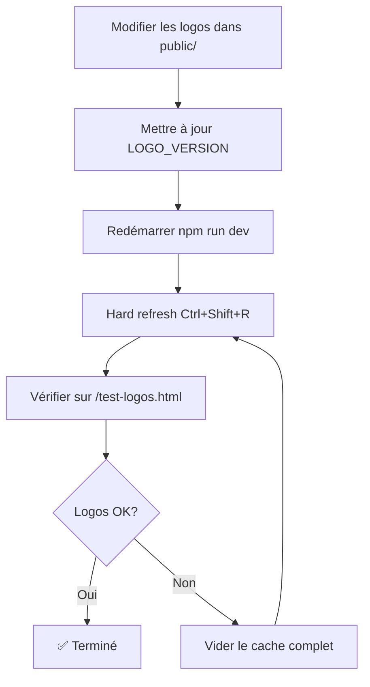

# 🎨 Système de Gestion des Logos - Odin La Science

## 📋 Vue d'Ensemble

Ce document explique le système de cache-busting des logos implémenté pour résoudre le problème d'affichage des logos modifiés.

## 🎯 Problème Résolu

**Situation** : Les logos ont été modifiés le 18/02/2026 mais les anciens logos continuaient à s'afficher à cause du cache du navigateur.

**Solution** : Système de cache-busting dynamique avec timestamp automatique.

## 📁 Fichiers du Système

### Code Source
- `src/utils/logoCache.ts` - Utilitaire de cache-busting
- `src/components/Navbar.tsx` - Utilise LOGOS.main
- `src/components/Footer.tsx` - Utilise LOGOS.main
- `src/components/MobileBottomNav.tsx` - Utilise LOGOS.main
- `src/pages/Login.tsx` - Utilise LOGOS.main
- `src/pages/Register.tsx` - Utilise LOGOS.main
- `src/pages/LandingPage.tsx` - Utilise LOGOS.main
- `src/pages/Munin.tsx` - Utilise LOGOS.munin
- `src/pages/Hugin.tsx` - Utilise LOGOS.hugin
- `src/pages/mobile/LandingPage.tsx` - Utilise LOGOS.main

### Outils et Documentation
- `public/test-logos.html` - Page de test interactive
- `clear-browser-cache.ps1` - Script de nettoyage automatique
- `ACTION_IMMEDIATE_LOGOS.md` - Guide d'action rapide
- `SOLUTION_LOGOS_CACHE.md` - Solution détaillée
- `LOGOS_CACHE_BUSTING.md` - Documentation technique
- `RESOLUTION_LOGOS_FINALE.md` - Résumé complet
- `GUIDE_VISUEL_LOGOS.md` - Guide visuel pas à pas

## 🚀 Utilisation

### Pour les Utilisateurs

**Méthode 1 : Hard Refresh (Recommandé)**
```
1. Ouvrir le site
2. Appuyer sur Ctrl+Shift+R (Windows/Linux) ou Cmd+Shift+R (Mac)
3. Les nouveaux logos s'affichent
```

**Méthode 2 : Page de Test**
```
1. Aller sur http://localhost:5173/test-logos.html
2. Cliquer sur "Forcer le rechargement des logos"
3. Vérifier les 4 logos
```

**Méthode 3 : Script Automatique**
```powershell
.\clear-browser-cache.ps1
```

### Pour les Développeurs

**Utiliser les logos dans le code** :
```typescript
import { LOGOS } from '../utils/logoCache';

// Dans votre composant


```

**Modifier les logos** :
```typescript
// 1. Remplacer les fichiers dans public/

// 2. Mettre à jour la version dans src/utils/logoCache.ts
const LOGO_VERSION = '20260220-1500'; // Nouvelle date

// 3. Redémarrer le serveur
npm run dev

// 4. Hard refresh
Ctrl+Shift+R
```

## 📊 Logos Disponibles

| Constante | Fichier | Taille | Utilisation |
|-----------|---------|--------|-------------|
| `LOGOS.main` | logo1.png | 668 KB | Logo principal Odin (Navbar, Login, Register, Landing) |
| `LOGOS.munin` | logo2.png | 395 KB | Logo Munin Atlas (Page Munin) |
| `LOGOS.hugin` | logo3.png | 107 KB | Logo Hugin Lab (Page Hugin) |
| `LOGOS.alt` | logo4.png | 692 KB | Logo alternatif (réservé pour usage futur) |

## 🔧 Fonctionnement Technique

### Cache-Busting Dynamique
```typescript
// Génère une URL unique à chaque chargement
export const getLogoUrl = (logoName: string): string => {
  const timestamp = Date.now();
  return `/${logoName}?v=${LOGO_VERSION}&t=${timestamp}`;
};
```

### Exemple d'URL Générée
```
/logo1.png?v=20260218-2000&t=1708351234567
         └─ Version      └─ Timestamp unique
```

### Avantages
- ✅ Pas de cache navigateur
- ✅ Rechargement automatique
- ✅ Timestamp unique à chaque visite
- ✅ Facile à maintenir

## 📖 Documentation

### Guides Rapides
1. **ACTION_IMMEDIATE_LOGOS.md** - Pour résoudre le problème rapidement (30 secondes)
2. **GUIDE_VISUEL_LOGOS.md** - Guide visuel avec captures et checklist

### Documentation Détaillée
1. **SOLUTION_LOGOS_CACHE.md** - Toutes les méthodes de résolution
2. **LOGOS_CACHE_BUSTING.md** - Documentation technique du système
3. **RESOLUTION_LOGOS_FINALE.md** - Résumé complet avec tous les détails

## 🧪 Tests

### Test 1 : Page de Test
```
URL : http://localhost:5173/test-logos.html
Résultat attendu : Les 4 logos s'affichent correctement
```

### Test 2 : DevTools Network
```
1. F12 → Network
2. Filtrer par "logo"
3. Actualiser
4. Vérifier : /logo1.png?v=20260218-2000&t=...
```

### Test 3 : Navigation Privée
```
1. Ouvrir une fenêtre privée
2. http://localhost:5173
3. Les nouveaux logos doivent s'afficher
```

## 🔄 Workflow de Modification



## 🆘 Dépannage

### Problème : Les logos ne changent pas
```
Solution :
1. Vérifier que les fichiers existent : dir public\*.png
2. Vider le cache : Ctrl+Shift+Delete
3. Redémarrer le serveur : npm run dev
4. Hard refresh : Ctrl+Shift+R
```

### Problème : Les URLs n'ont pas de paramètres
```
Solution :
1. Vérifier que src/utils/logoCache.ts existe
2. Vérifier les imports dans les composants
3. Rebuild : npm run build
4. Redémarrer : npm run dev
```

### Problème : Ça marche en navigation privée seulement
```
Solution :
1. Le cache normal est corrompu
2. Exécuter : .\clear-browser-cache.ps1
3. Ou vider manuellement : Ctrl+Shift+Delete
```

## 📞 Support

### Commandes Utiles
```bash
# Vérifier les logos
dir public\*.png

# Redémarrer le serveur
npm run dev

# Rebuild complet
npm run build

# Vider le cache
.\clear-browser-cache.ps1
```

### URLs Utiles
```
Test des logos : http://localhost:5173/test-logos.html
Login          : http://localhost:5173/login
Register       : http://localhost:5173/register
Munin          : http://localhost:5173/munin
Hugin          : http://localhost:5173/hugin
```

## ✅ Checklist de Vérification

- [ ] Les 4 fichiers PNG sont dans `public/`
- [ ] `src/utils/logoCache.ts` existe
- [ ] Tous les composants importent `LOGOS`
- [ ] Le serveur est lancé (`npm run dev`)
- [ ] Hard refresh effectué (`Ctrl+Shift+R`)
- [ ] Page de test fonctionne (`/test-logos.html`)
- [ ] Nouveaux logos visibles sur toutes les pages
- [ ] URLs contiennent `?v=20260218-2000&t=...`

## 🎉 Résultat

Après l'implémentation :
- ✅ Système de cache-busting automatique
- ✅ Logos se rechargent à chaque visite
- ✅ Plus de problème de cache
- ✅ Facile à maintenir et à mettre à jour
- ✅ Documentation complète

---

**Version** : 1.0
**Date** : 19/02/2026
**Logos modifiés le** : 18/02/2026
**Cache-busting version** : 20260218-2000
**Status** : ✅ Opérationnel
**Build** : ✅ Testé et validé
**Commit** : bb30ddc
